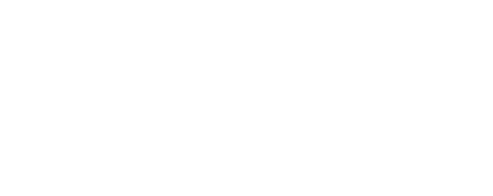
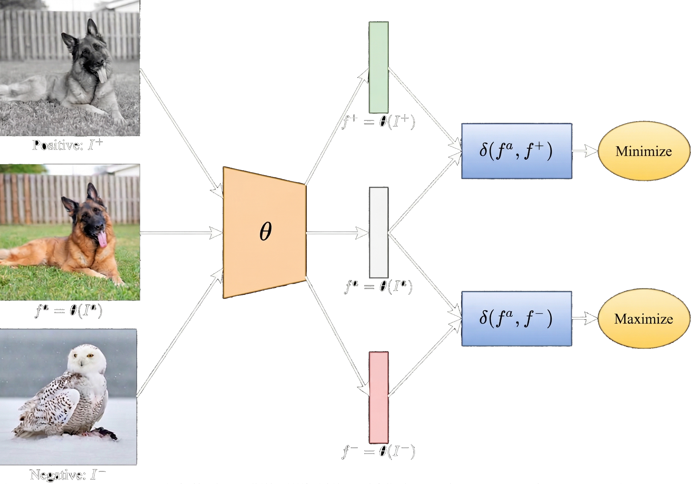
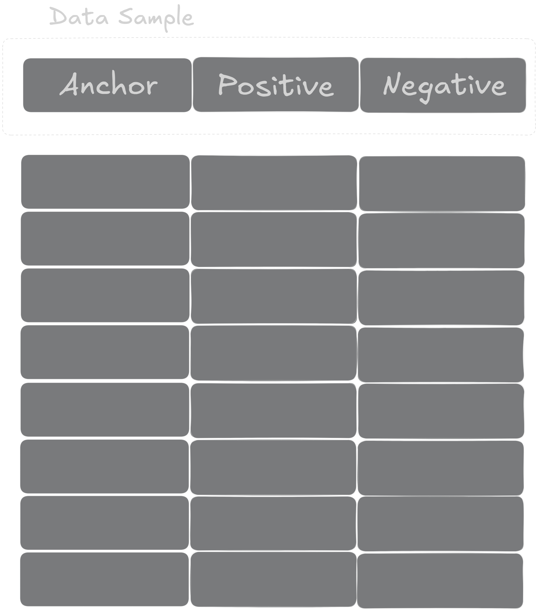
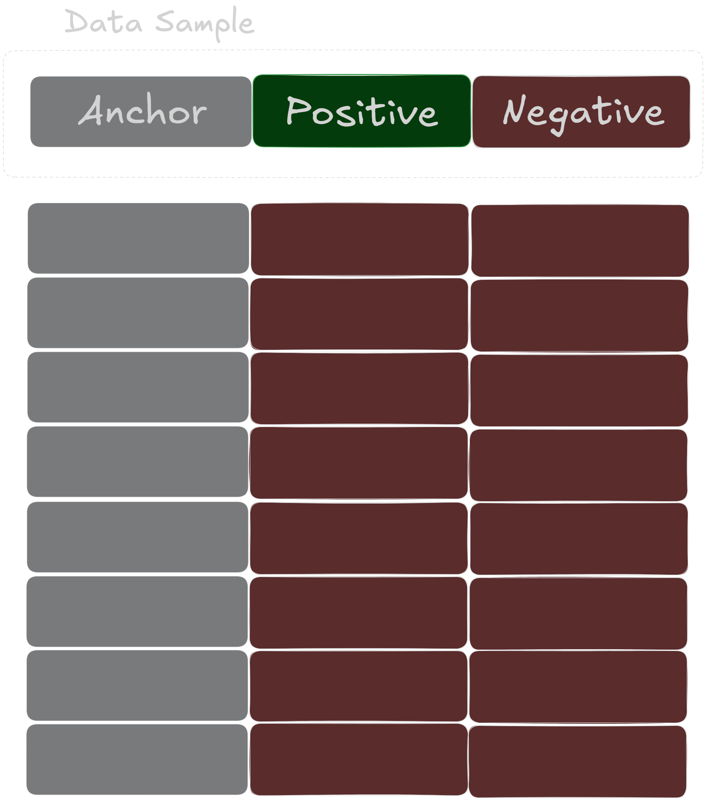
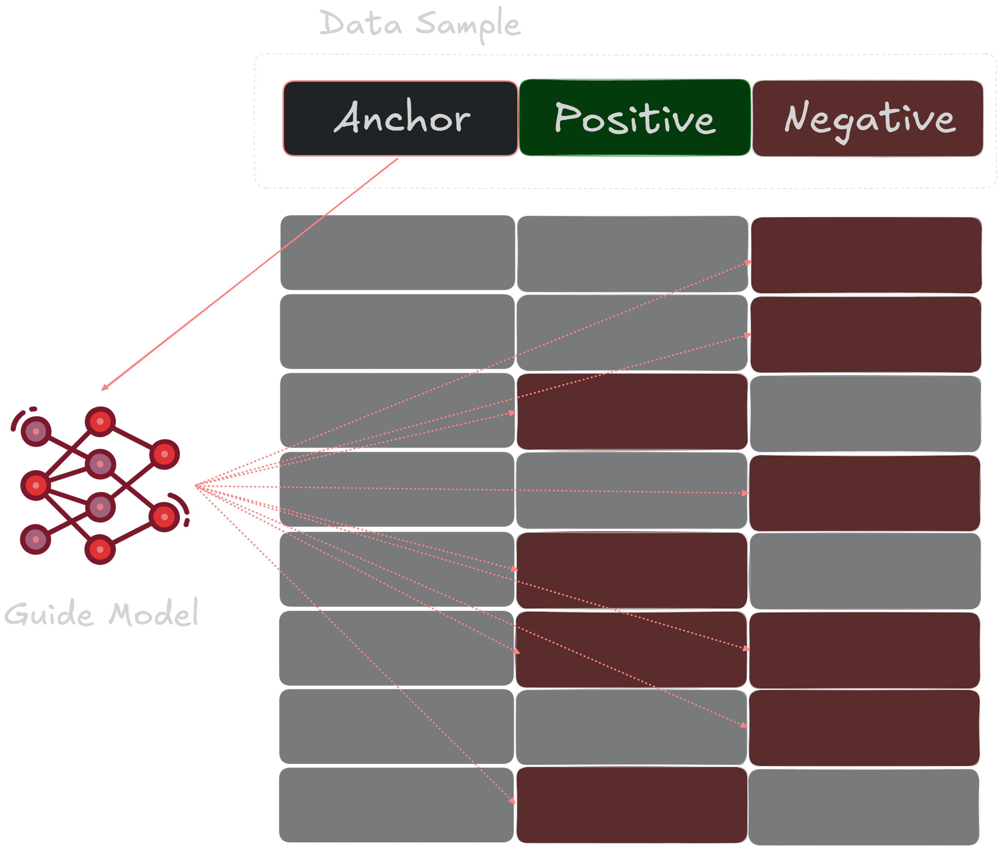
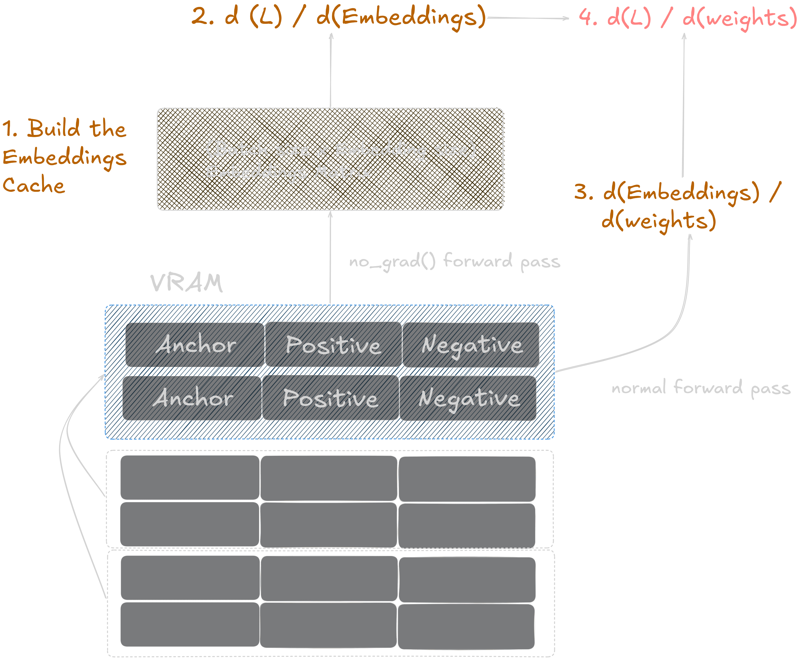

## Agenda 

::: {style="height: 80%; display: flex; flex-direction: column; justify-content: center;"}

- Huh? NextGen ... what? Why heterogenous compute at all? (15 min)
- Part 1: The FL framework (the engineering solution) (35 min)
- 10 min. break :coffee:
- Part 2: Use-case integration - RAG for medical leaflets (AstraZeneca) (50 min)
- Discussion & Q/A session (10 min)

:::


## {background-image="assets/cost.jpg" background-size="contain" data-state="hide-ui"}

::: {.absolute bottom="10%" right="10%" style="font-size: 0.5em; color: #ffffff; background-color: rgba(0,0,0,0.5); padding: 5px 10px; border-radius: 5px;"}
Source: Ethan Mollick, oneusefulthing.org
:::


## Adoption of Frontier Models {background-color="#FCFBFA"}

```{=html}
<div style="margin-top: 120px; width: 100%; height: 800px; display: flex; flex-direction: row; justify-content: center; align-items: center; gap: 30px; overflow: hidden;">
  <iframe src="https://datawrapper.dwcdn.net/wQR5S" style="flex: 1; height: 100%; border: none; transform: scale(1.04); transform-origin: center center;" scrolling="no"></iframe>
  <iframe src="https://datawrapper.dwcdn.net/jWDre" style="flex: 1; height: 100%; border: none; transform: scale(1.04); transform-origin: center center;" scrolling="no"></iframe>
  <iframe src="https://datawrapper.dwcdn.net/hOCCz" style="flex: 1; height: 100%; border: none; transform: scale(1.04); transform-origin: center center;" scrolling="no"></iframe>
</div>
```

## {background-image="assets/usage_4x.png" background-size="contain" data-state="hide-ui"}

::: {.absolute bottom="70%" right="0%" style="font-style: italic; width: 65%; font-size: 0.7em; color: #ffffff; background-color: rgba(0,0,0,0.5); padding: 5px 10px; border-radius: 5px;"}
By introducing the **"Token Economics"** framework, we further quantify the efficiency gap, revealing that owning the infrastructure yields up to an **18x cost advantage** per million tokens compared to Model-as-a-Service APIs, offering a strategic roadmap for enterprises seeking to maximize the return on their AI investments over a five-year lifecycle.
:::


::: {.absolute bottom="5%" right="0%" style="font-size: 0.5em; color: #ffffff; background-color: rgba(0,0,0,0.5); padding: 5px 10px; border-radius: 5px;"}
Source: Sachin Gopal Wani, David Ellison, Jarrett Upton. **On-Premise vs Cloud: Generative AI Total Cost of Ownership (2026 Edition).**
:::

## Data Sovereignty & Regulatory Governance

::: {.incremental .spaced-list style="margin-top: 10%;"}

- **In the U.S.**: an unprecedented 741 AI-related legislative bills were introduced across 30 states by early 2026 [Predictions for 2026: More AI, More Litigation](https://www.esquiresolutions.com/predictions-for-2026-more-ai-more-litigation/)

- **In Europe**: Artificial Intelligence Act (EU AI Act), the Digital Operational Resilience Act (DORA), the General Data Protection Regulation (GDPR), ...

- **Result:** 62% of European organizations are actively seeking sovereign AI architectures, a trend led heavily by the banking sector (76%) and organizations in Germany (73%) and Switzerland (64%). [Europe Seeking Greater AI Sovereignty, Accenture Report Finds](https://newsroom.accenture.com/news/2025/europe-seeking-greater-ai-sovereignty-accenture-report-finds)
:::

## On-Prem vs. Cloud

::: {style="margin-top: 8%;"}
There are methods that are tightly coupled not just to data, but to internal infrastructure and proprietary data-generating mechanisms.
:::

::: {.incremental .spaced-list style="margin-top: 2%;"}

- **Retrieval-Augmented Generation (RAGs)** are strongly coupled to large vector databases that are updated frequently. Context rot is an issue in RAGs that use generalist models which require extensive prompts alongside packed context data.

- **Agentic workflows** are strongly coupled with internal infrastructure, real-time data and are heavily dependent on e.g. specialist domain expert roles and data formats. Example: Benchmarking the "Time To First Token" (TTFT): at the 50th percentile (P50), local inference achieves 15 to 30 milliseconds. Cloud APIs: 100-300 ms range depending on the provider's current load. [The 2026 Definitive Guide to Running Local LLMs in Production](https://www.sitepoint.com/the-2026-definitive-guide-to-running-local-llms-in-production/)

:::

## Specialists vs. Generalists

::: {.incremental .spaced-list style="margin-top: 5%;"}

- **General finetuning**: APIs are traditionally limited to Supervised Fine Tuning using simple configs. What about Self-Supervised Learning, Contrastive Learning, Reinforcement Learning, Federated Learning, performance monitoring / auditing, using custom losses, alignment process, vocabularies, tokenizers?

- **PEFT (parameter-efficient fine tuning)** is a breakthrough technique to add model capabilities without detracting others. Historically: fine-tuning a 7-billion parameter model required a $50,000 cluster of NVIDIA H100 GPUs. With QLoRA: single $1,500 consumer-grade graphics card. [Why Everyone Is Fine-Tuning LLMs for Their Domain (And What Actually Works)](https://medium.com/@prabhuss73/why-everyone-is-fine-tuning-llms-for-their-domain-and-what-actually-works-7d9d491e4b03
)

- **Small, capable agents**: *"There’s a vastly underserved market of enterprises that want cheap, reliable models for repetitive use-cases in their systems.... Every task that a frontier agentic model does tens to hundreds of times can potentially be outsourced to a small model."* [What Comes Next With Open Models](https://www.interconnects.ai/p/the-next-phase-of-open-models)

:::

## {background-image="assets/glm.png" background-size="contain" data-state="hide-ui"}

::: {.absolute bottom="85%" right="10%" style="font-size: 0.5em; color: #ffffff; background-color: rgba(0,0,0,0.5); padding: 5px 10px; border-radius: 5px;"}
Source: https://z.ai/blog/glm-5
:::


## {background-image="assets/figure3.png" background-size="cover" data-state="hide-ui"}

::: {.absolute bottom="0%" right="65%" style="font-size: 0.5em; color: #ffffff; background-color: rgba(0,0,0,0.5); padding: 5px 10px; border-radius: 5px;"}
Source: https://time.com/7324233/figure-03-robot-humanoid-reveal/
:::

## {auto-animate="true"}

::: {style="height: 100%; display: flex; flex-direction: column; justify-content: center; align-items: center; text-align: center; font-size: 2em; font-weight: bold;"}
Specialization is here to stay
:::

## {auto-animate="true"}

::: {style="height: 100%; display: flex; flex-direction: column; justify-content: center; align-items: center; text-align: center; font-size: 2em; font-weight: bold;"}
<span style="color: #FECB00;">Decentralized</span> Specialization is here to stay
:::

## Project Partners

```{=html}
<div style="width: 100%; margin-top: 200px; display: flex; flex-wrap: wrap; justify-content: center; align-items: center; gap: 80px;">
  
  
  
  
  <div style="flex-basis: 100%; height: 0; margin: 0; padding: 0;"></div>
  
  
  
</div>
```

```{=html}
<div style="position: absolute; bottom: 5%; right: 5%; display: flex; align-items: center; gap: 30px; font-size: 1em;">
  <span style="line-height: 1;">Co-funded by</span>
  
</div>
```

## NextGen Infrastructure {background-image="assets/concept.png" background-size="75%"}

## {background-image="assets/tpu.png" background-size="contain" data-state="hide-ui"}

::: {.absolute bottom="0%" right="0%" style="font-size: 0.5em; color: #ffffff; background-color: rgba(0,0,0,0.5); padding: 5px 10px; border-radius: 5px;"}
Source: https://www.allaboutcircuits.com/news/trillium-googles-tpu-powerhouse-behind-new-ai-models/
:::

## {background-image="assets/trainium_2x.png" background-size="contain" data-state="hide-ui"}

::: {.absolute bottom="0%" right="0%" style="font-size: 0.5em; color: #ffffff; background-color: rgba(237, 226, 226, 0.5); padding: 5px 10px; border-radius: 5px;"}
Source: AWS
:::

## {background-image="assets/maia.jpg" background-size="cover" data-state="hide-ui"}

::: {.absolute bottom="0%" right="0%" style="font-size: 0.5em; color: #ffffff; background-color: rgba(0,0,0,0.5); padding: 5px 10px; border-radius: 5px;"}
Source: https://blogs.microsoft.com/blog/2026/01/26/maia-200-the-ai-accelerator-built-for-inference/
:::

## {background-image="assets/cerebras.png" background-size="cover" data-state="hide-ui"}

::: {.absolute bottom="0%" right="0%" style="font-size: 0.5em; color: #ffffff; background-color: rgba(0,0,0,0.5); padding: 5px 10px; border-radius: 5px;"}
Source: https://www.cerebras.ai/chip
:::

## {background-image="assets/openclaw.png" background-size="cover" data-state="hide-ui"}

::: {.absolute bottom="0%" right="0%" style="font-size: 0.5em; color: #ffffff; background-color: rgba(237, 226, 226, 0.5); padding: 5px 10px; border-radius: 5px;"}
Source: https://www.instagram.com/p/DVB7uvBjE3T/
:::

## Agenda 

::: {style="height: 80%; display: flex; flex-direction: column; justify-content: center;"}

- Huh? NextGen ... what? Why heterogenous compute at all? (15 min)
- [Part 1: The FL framework (the engineering solution) (35 min)]{style="color: #FECB00; font-weight: bold;"}
- 10 min. break :coffee:
- Part 2: Use-case integration - RAG for medical leaflets (AstraZeneca) (35 min)
- Discussion & Q/A session (10 min)

:::

## The Requirements (1)

::: {.incremental .spaced-list style="margin-top: 10%;"}

- Support not only for heterogeneous compute, but heterogenous environments: training locally on your laptop, in a virtual machine, behind a scheduler in a compute cluster, in the cloud, etc. Heterogeneous software stacks and programming languages!

- Targeting fault tolerance across few compute nodes, rather than optimizing for scaling across 1000s of nodes. Leverage abstraction of what a "compute node" is!

- Security:  Minimize the cybersecurity attack surface! Orchestration-free, "blackboard pattern". Nothing is forcibly "pushed" to clients. Clients don't speak to each other, or even directly with the server. The "server" is just another type of client!

:::

## The Requirements (2)

::: {.incremental .spaced-list style="margin-top: 10%;"}

- Surgical control over training configuration and the training procedure. No vendor lock-in or high level abstractions that make it hard to optimize for maximum local efficiency

- Natively MLOps-Integrated and Auditable. This framework isn't a standalone library; it's a complete workflow that is deeply integrated with a modern, best-in-class MLOps toolchain.

- Thin wrapper over existing natives: minimal dependencies, as close to "plug & play" as possible! Required to run in restrictive environments like HPC clusters in corporate environments. 

:::

## Async & State-Driven {background-image="assets/nextgen2.png" background-size="80%"}

## How To Use?

::: {style="margin-top: 10%;"}

This framework can be easily imported into an existing project. It's a lean wrapper over "abstract" FL training methods, so no messy dependencies.

<div style="margin-top: 40px;"></div>

  ```yaml {code-line-numbers="3-8|10-14"}
  # In your pyproject.toml ...

  [[tool.uv.index]]
  name = "nextgen"
  url = "https://gitlab.mgmt.ai.se/api/v4/projects/63/packages/pypi/simple"

  [tool.uv.sources]
  nextgen_framework = { index = "nextgen" }

  [dependency-groups]
  training = [
      "nextgen_framework",
      ...
  ]
  ```

:::

## How To Use?

::: {style="margin-top: 10%;"}

Wrap your training logic. Note: the framework makes absolutely **no assumptions** about what is actually being trained! Just need to override what happens in the key parts of the FL loop.

<div style="margin-top: 60px;"></div>

  ```python {code-line-numbers="3|8,11,14,17|11,14"}
  from nextgen_framework.interfaces import BaseTrainer, TrainerArgs

  class Trainer(BaseTrainer):
      
      def __init__(self, cfg: TrainerArgs):
          super().__init__(cfg)
      
      def setup(self) -> Path:
          """Runs on the server, creates the initial model, and returns a Path to it."""
      
      def train(self, model_path: Path, version: str) -> Path:
          """Runs on the client, train the model for a given set of steps."""
      
      def reduce_models(self, model_paths: list[Path], version: str) -> Path:
          """Runs on the server, merges models from the given Paths"""

      def eval_model(self, model_path: Path, version: str) -> None:
          """Runs on the server. Evaluates a global model checkpoint"""
  ```
:::

## How To Use?

::::: {style="margin-top: 5%;"}

Parametrize your application using [Hydra](https://hydra.cc/). Installing the NextGen framework dependency gives you access to the "controls" for the FL training elements.

<div style="margin-top: 30px;"></div>

:::: {.columns}

::: {.column width="50%"}

```yaml {.number-lines}
# File: my/hydra/config.yaml

defaults:
    - _self_
    - framework: framework
    - trainer: mytrainer
    - data: mydata
    - logger: mylogger
    - model: mymodel

# random seed
seed: 52

# Default overrides for the dummy run
run_name: "" # Leave empty to auto generate
output_dir: ./output-nextgen/

hydra:
    searchpath:
    - "pkg://nextgen_framework/config"


```

:::

::: {.column width="50%"}

```yaml {.number-lines}
# File: mymodel.yaml

_target_: sentence-transformers/all-mpnet-base-v2
trust_remote_code: true
revision: e8c3b32edf5434bc2275fc9bab85f82640a19130
model_kwargs:
  attn_implementation: "sdpa"
  torch_dtype: "bfloat16"
```

<div style="margin-top: 20px;"></div>

```yaml {.number-lines}
# File: nextgen_framework/config/framework
#
# These config options get imported and are 
# made available for you to override!

defaults:
  - _self_
  - node: master

max_iter: 2
model_description: ""

framework_runner:
  _target_: nextgen_framework.runner.FrameworkRunner


```

:::

::::

:::::


## How To Use?

::::: {style="margin-top: 5%;"}

Parametrize your application using [Hydra](https://hydra.cc/). Installing the NextGen framework dependency gives you access to the "controls" for the FL training elements.

<div style="margin-top: 30px;"></div>

:::: {.columns}

::: {.column width="50%"}

```yaml {code-line-numbers="9"}
# File: my/hydra/config.yaml

defaults:
    - _self_
    - framework: framework
    - trainer: mytrainer
    - data: mydata
    - logger: mylogger
    - model: mymodel

# random seed
seed: 52

# Default overrides for the dummy run
run_name: "" # Leave empty to auto generate
output_dir: ./output-nextgen/

hydra:
    searchpath:
    - "pkg://nextgen_framework/config"


```

:::

::: {.column width="50%"}

```yaml {code-line-numbers="1-8"}
# File: mymodel.yaml

_target_: sentence-transformers/all-mpnet-base-v2
trust_remote_code: true
revision: e8c3b32edf5434bc2275fc9bab85f82640a19130
model_kwargs:
  attn_implementation: "sdpa"
  torch_dtype: "bfloat16"
```

<div style="margin-top: 20px;"></div>

```yaml {code-line-numbers=1}
# File: nextgen_framework/config/framework
#
# These config options get imported and are 
# made available for you to override!

defaults:
  - _self_
  - node: master

max_iter: 2
model_description: ""

framework_runner:
  _target_: nextgen_framework.runner.FrameworkRunner


```

:::

::::

:::::


## How To Use?


::::: {style="margin-top: 5%;"}

Parametrize your application using [Hydra](https://hydra.cc/). Installing the NextGen framework dependency gives you access to the "controls" for the FL training elements.

<div style="margin-top: 30px;"></div>

:::: {.columns}

::: {.column width="50%"}

```yaml {code-line-numbers="5,18-20"}
# File: my/hydra/config.yaml

defaults:
    - _self_
    - framework: framework
    - trainer: mytrainer
    - data: mydata
    - logger: mylogger
    - model: mymodel

# random seed
seed: 52

# Default overrides for the dummy run
run_name: "" # Leave empty to auto generate
output_dir: ./output-nextgen/

hydra:
    searchpath:
    - "pkg://nextgen_framework/config"


```

:::

::: {.column width="50%"}

```yaml {code-line-numbers="1"}
# File: mymodel.yaml

_target_: sentence-transformers/all-mpnet-base-v2
trust_remote_code: true
revision: e8c3b32edf5434bc2275fc9bab85f82640a19130
model_kwargs:
  attn_implementation: "sdpa"
  torch_dtype: "bfloat16"
```

<div style="margin-top: 20px;"></div>

```yaml {.number-lines}
# File: nextgen_framework/config/framework
#
# These config options get imported and are 
# made available for you to override!

defaults:
  - _self_
  - node: master

max_iter: 2
model_description: ""

framework_runner:
  _target_: nextgen_framework.runner.FrameworkRunner


```

:::

::::

:::::


## How To Use?


::::: {style="margin-top: 5%;"}

Create an entry point and point it to your config, and you are ready to run!

<div style="margin-top: 30px;"></div>

:::: {.columns}

::: {.column width="50%"}

```python {code-line-numbers="7-10|15-16"}
# File: run_app.py

import hydra
from hydra.utils import instantiate
from omegaconf import OmegaConf

@hydra.main(
    config_path="../myproject/configs", 
    config_name="nextgen"
)
def main(cfg):
    """Entrypoint for NextGen"""

    print("--- Starting Framework Run ---")
    runner = instantiate(cfg.framework.framework_runner)
    runner.run(cfg)
    print("--- Framework Run Finished ---")

if __name__ == "__main__":
    main()


```

:::

::: {.column width="50%"}

```bash {.number-lines}
export MLFLOW_TRACKING_TOKEN=<your MLFlow PAT>
export MLFLOW_TRACKING_URI=\
    https://gitlab.mgmt.ai.se/api/v4\
    /projects/<your project ID>/ml/mlflow/

uv run python run_app.py \
    framework/node=client \
    framework.max_iter=5 \
    framework.node.client_id=1 \
    ...

```

:::

::::

:::::


## Running a Node - Barebones Docker

::::: {style="margin-top: 5%;"}

Specialize and optimize your running environment based on your compute!

<div style="margin-top: 10px;"></div>

:::: {.columns}

::: {.column width="50%"}

```Dockerfile {code-line-numbers="18-26|6-16"}
# syntax=docker/dockerfile:1.4

# ---- STAGE 1: Builder --------------------------------
FROM python:3.12-slim-bookworm AS builder

COPY pyproject.toml uv.lock ./

# Export requirements text locally
RUN uv export --frozen --no-dev --group training \
--group gaudi --no-hashes --no-emit-project \
--format requirements-txt > requirements.txt

# Filter out hardware-specific packages to protect the 
# base image binaries
RUN grep -vE '^(torch|torchvision|torchaudio|vllm|nvidia|triton)' \
requirements.txt > requirements.final.txt

# ---- STAGE 2: Production ------------------------------
# Base Image MUST match driver version (see hl-smi)
FROM vault.habana.ai/gaudi-docker/1.23.0/ubuntu22.04\
     /habanalabs/pytorch-installer-2.9.0:latest

RUN uv pip install --no-deps -r requirements.final.txt

# Expect application code to be mounted at runtime.
CMD ["/bin/bash"]


```

:::

::: {.column width="50%"}

```bash {.number-lines}
#!/bin/bash
...
IMAGE_NAME="$1"

docker run -it --rm \
  --runtime=habana \
  --privileged \
  --cap-add=sys_nice \
  --cap-add=IPC_LOCK \
  --ipc=host \
  --net=host \
  --ulimit memlock=-1:-1 \
  --ulimit stack=67108864 \
  -e HABANA_VISIBLE_DEVICES=$DEVICE_ID \
  -e PT_HPU_ENABLE_CPU_FALLBACK_LOGGING=1 \
  -e DDP_SHARED_ID=$RANDOM \
  -v "$PROJECT_ROOT":/workspace \
  -v ~/.cache/huggingface:/workspace/cache \
  "$IMAGE_NAME" \
  "$@"

```

:::

::::

:::::


## Running a Node - Scheduler (AiQU)

::::: {style="margin-top: 5%;"}

AiQU creates a container for an input Docker image and runs it. We create a REST request to the AiQU API with our job parameters that references the Docker image with the most recent code version.

<div style="margin-top: 30px;"></div>

:::: {.columns}

::: {.column width="45%"}

```yaml {code-line-numbers="1,3-7"}
# File: .gitlab.ci

# Imports deployment jobs from the nextgen_framework
include:
  - project: 'nextgeninfra/nextgen_framework'
    ref: 'main'
    file: '/templates/aiqu.yml'


# --- NEXTGEN AIQU INTEGRATION ---

deploy-aiqu:
  stage: deploy
  extends: .deploy-node
  variables:
    # Image tag pushed by this CI pipeline!
    IMAGE: $CI_PROJECT_PATH:$CI_COMMIT_SHORT_SHA
    QID: 23
    STORAGE_ID: 225
    STORAGE_SOURCE: mydata
    STORAGE_TO: mydata
    MLFLOW_API_TOKEN: "$MLFLOW_API_TOKEN"


```

:::


::: {.column width="55%"}

```yaml {code-line-numbers="1"}
# File: nextgen_framework/templates/aiqu.yaml

.deploy-node:
  extends: .aiqu_setup
  variables:

    QID: ""
    GPUs: ""
    IMAGE: ""
    ...

  script:
    - |
      ...
      DATA=$(printf '{ 
          "queueid": %d, "nr_gpu": %d, "image": "%s", ...}' 
          "$QID" "$GPUS" "$IMAGE" ...)

      echo "Submitting job to AiQU with payload:"
      RESPONSE=$(curl -s -X POST --header "accept: application/json" \
          --header "Session: $SESSION" --header "Token: $TOKEN" \
          --header "Content-Type: application/json" \
          --data "$DATA" https://rest.aiqu.ai/job)


```
:::

::::

:::::


## Running a Node - Scheduler (AiQU)

::::: {style="margin-top: 5%;"}

AiQU creates a container for an input Docker image and runs it. We create a REST request to the AiQU API with our job parameters that references the Docker image with the most recent code version.

<div style="margin-top: 30px;"></div>

:::: {.columns}

::: {.column width="45%"}

```yaml {code-line-numbers="12,14,17,22"}
# File: .gitlab.ci

# Imports deployment jobs from the nextgen_framework
include:
  - project: 'nextgeninfra/nextgen_framework'
    ref: 'main'
    file: '/templates/aiqu.yml'


# --- NEXTGEN AIQU INTEGRATION ---

deploy-aiqu:
  stage: deploy
  extends: .deploy-node
  variables:
    # Image tag pushed by this CI pipeline!
    IMAGE: $CI_PROJECT_PATH:$CI_COMMIT_SHORT_SHA
    QID: 23
    STORAGE_ID: 225
    STORAGE_SOURCE: mydata
    STORAGE_TO: mydata
    MLFLOW_API_TOKEN: "$MLFLOW_API_TOKEN"


```

:::


::: {.column width="55%"}

```yaml {.number-lines}
# File: nextgen_framework/templates/aiqu.yaml

.deploy-node:
  extends: .aiqu_setup
  variables:

    QID: ""
    GPUs: ""
    IMAGE: ""
    ...

  script:
    - |
      ...
      DATA=$(printf '{ 
          "queueid": %d, "nr_gpu": %d, "image": "%s", ...}' 
          "$QID" "$GPUS" "$IMAGE" ...)

      echo "Submitting job to AiQU with payload:"
      RESPONSE=$(curl -s -X POST --header "accept: application/json" \
          --header "Session: $SESSION" --header "Token: $TOKEN" \
          --header "Content-Type: application/json" \
          --data "$DATA" https://rest.aiqu.ai/job)


```
:::

::::

:::::

## {background-image="assets/aiqu2.png" background-size="cover" data-state="hide-ui"}

##

::: {style="height: 80%; display: flex; justify-content: center; align-items: center; font-size: 2em; font-weight: bold; text-align: center;"}
Demo Time! :rocket:
:::


## Agenda 

::: {style="height: 80%; display: flex; flex-direction: column; justify-content: center;"}

- Huh? NextGen ... what? Why heterogenous compute at all? (15 min)
- Part 1: The FL framework (the engineering solution) (35 min)
- [10 min. break :coffee:]{style="color: #FECB00; font-weight: bold;"}
- Part 2: Use-case integration - RAG for medical leaflets (AstraZeneca) (35 min)
- Discussion & Q/A session (10 min)

:::

## Agenda 

::: {style="height: 80%; display: flex; flex-direction: column; justify-content: center;"}

- Huh? NextGen ... what? Why heterogenous compute at all? (15 min)
- Part 1: The FL framework (the engineering solution) (35 min)
- 10 min. break :coffee:
- [Part 2: Use-case integration - RAG for medical leaflets (AstraZeneca) (35 min)]{style="color: #FECB00; font-weight: bold;"}
- Discussion & Q/A session (10 min)

:::


## {background-image="assets/meds.png" background-repeat="no-repeat" data-state="hide-ui"}


## Medical Leaflet & Labelling Data

::: {.spaced-list style="margin-top: 10%;"}

- [EMA list of available medicines](https://www.ema.europa.eu/en/medicines/download-medicine-data) (ca. 2k), with each leaflet .pdf spanning 50-100 pages 

- [OpenFDA](https://open.fda.gov/data/downloads/): "is an Elasticsearch-based API that serves public FDA data about nouns like drugs, devices, and foods. Each of these nouns has one or more categories, which serve unique data-such as data about recall enforcement reports, or about adverse events"

- [DailyMed](https://dailymed.nlm.nih.gov/dailymed/) database contains ~150,000 labeling for prescription and nonprescription drugs for human and animal use, submitted to the Food and Drug Administration (FDA) by companies.

:::

## {background-image="assets/az.svg" background-size="cover" data-state="hide-ui"}

## Contrastive Learning

<div style="width: 100%; text-align: center; margin-top: 5%;">
  
</div>

::: {.absolute bottom="5%" right="5%" style="font-size: 0.6em; color: rgba(255, 255, 255, 0.6); background-color: rgba(0, 0, 0, 0.5); padding: 5px 10px; border-radius: 5px;"}
Credits: [Deep Learning at Skoltech 2023](https://github.com/oseledets/dl2023/blob/main/lectures/lecture-10/lecture-10.ipynb)
:::


## MultipleNegativesRankingLoss

::::: {.columns}

:::: {.column width="55%"}

:::: {.spaced-list style="margin-top: 10%;"}

- The "bread and butter" of modern text embedding fine-tuning. Advantage: doesn't stricly require negatives.

- For each sample `(Anchor, Positive)` in a batch: assign every other anchor's `Positive` as a negative. For a batch size `k`, we get `k-1` negatives per anchor.

- Loss is basically just a classification (Cross Entropy) loss to "predict" each anchor's `Positive`:

    $$L = -\frac{1}{n} \sum_{i=1}^{n} \log \frac{e^{sim(a_i, p_i) / \tau}}{\sum_{j=1}^{n} e^{sim(a_i, p_j) / \tau}}$$


::::

::::


:::: {.column width="5%"}
::::


:::: {.column width="40%"}

<div class="r-stack" style="width: 100%; margin-top: 10%;">
  
  
  
</div>

::::

:::::


## CachedGISTEmbedLoss

::::: {.columns}

:::: {.column width="50%"}

:::: {style="margin-top: 10%;"}

<ul class="spaced-list">
  
  <li>Adresses two issues with MNRL / InfoNCE :</li>
  <br>
  <li class="fragment" data-fragment-index="1">
    <strong>False Negatives</strong> - instead of matching every anchor to <em>every</em> other anchor's positive / negative as a negative, let's filter out the bad matches
  </li>
  <br>
  <li class="fragment" data-fragment-index="2">
    <strong>Memory Usage</strong> - <span style="color: #FECB00; font-weight: bold;">using large batches is key</span>, but difficult to manage in memory! We can process mini-batches instead of whole batches.
  </li>
</ul>

::::

::::


:::: {.column width="50%"}

<div class="r-stack" style="width: 100%; margin-top: 10%;">
  
  

  
</div>

::::

:::::

##

::: {style="text-align: center; margin-top: 10%;"}
<h2 style="font-size: 1.3em; line-height: 1.3;">
  Batch size isn't an efficiency metric.<br>
  <span style="color: #FECB00; font-weight: bold;">It’s the definition of the task.</span>
</h2>
:::

<div style="margin-top: 60px;"></div>

:::: {.columns style="text-align: center; font-size: 1.1em;"}

::: {.column width="50%"}
<div style="padding: 20px; border-top: 3px solid #4CAF50;">
  <strong style="font-size: 1.1em; color: #4CAF50;">8,192 Batch</strong><br>
  <br>
  Navigating a <em>sharp, high-resolution</em><br>loss landscape.
</div>
:::

::: {.column width="50%"}
<div style="padding: 20px; border-top: 3px solid #FF9800;">
  <strong style="font-size: 1.1em; color: #FF9800;">2,048 Batch</strong><br>
  <br>
  Navigating a <em>flat, low-resolution</em><br>loss landscape.
</div>
:::

::::

<div style="margin-top: 80px;"></div>

::: {style="text-align: center; font-size: 1.1em; margin: 0 auto; width: 90%; color: #DDDDDD;"}
In FL with heterogenous compute: averaging these models without weighting or scaling is mathematically equivalent to mixing high- and low-definition signals.
:::

## Datasets

::: {.spaced-list style="margin-top: 10%;"}

- 
<div style="width: 100%; box-sizing: border-box; display: flex; justify-content: space-between; align-items: center; background-color: rgba(255, 255, 255, 0.05); padding: 15px 30px; border-radius: 12px; margin-bottom: 40px; font-size: 0.9em; font-weight: bold; text-align: center; border: 1px solid rgba(255,255,255,0.1);">
  <span>Raw Data (XMLs, Parquet)</span>
  <span style="color: #4CAF50; font-size: 1.2em;">➔</span>
  <span>Generate Q&A</span>
  <span style="color: #4CAF50; font-size: 1.2em;">➔</span>
  <span>Combine Datasets</span>
  <span style="color: #4CAF50; font-size: 1.2em;">➔</span>
  <span>Mine Negatives</span>
  <span style="color: #4CAF50; font-size: 1.2em;">➔</span>
  <span style="color: #E63946;">Train</span>
</div>

- **Combined QA**: [nicher92/combined_pharma_qa](https://huggingface.co/datasets/nicher92/combined_pharma_qa) -- This data is used for <span style="background-color: rgba(76, 175, 80, 0.15); color: #4CAF50; padding: 2px 6px; border-radius: 4px; font-weight: bold;">in-batch negative training</span>. It contains the positive pairs from the [EMA leaflets](https://www.ema.europa.eu/en/medicines/download-medicine-data) + ~1 million pharmaceutical related texts from [fineweb-edu](https://huggingface.co/datasets/HuggingFaceFW/fineweb-edu).

- **Mined Negatives QA**: [nicher92/mined_negatives_pharma_qa](https://huggingface.co/datasets/nicher92/mined_negatives_pharma_qa) -- This is the [DailyMed data](https://dailymed.nlm.nih.gov/dailymed/), parsed and structured with <span style="background-color: rgba(230, 57, 70, 0.15); color: #E63946; padding: 2px 6px; border-radius: 4px; font-weight: bold;">hard negatives</span> for training, ~ 2 million examples.

:::

## Training Data Sample (Hard Negatives)

<div style="margin-top: 5%;"></div>

:::: {.columns}

::: {.column width="32%"}
<div style="background-color: rgba(255, 255, 255, 0.05); border: 1px solid rgba(255, 255, 255, 0.1); border-top: 4px solid #4CAF50; padding: 20px; border-radius: 8px; font-size: 0.85em; box-sizing: border-box; height: 100%;">
<p style="border-bottom: 1px solid rgba(255,255,255,0.1); padding-bottom: 10px; margin-bottom: 15px; margin-top: 0;">
<strong style="font-size: 1.1em; color: #ffffff;">Anchor</strong> <span style="color: #aaaaaa; font-size: 0.9em;">(Query)</span>
</p>
<p style="margin-bottom: 0;">What adverse reactions were reported more commonly in patients taking <span style="background-color: rgba(255, 152, 0, 0.2); color: #FF9800; font-weight: bold; padding: 2px 4px; border-radius: 4px;">METFORMIN HYDROCHLORIDE</span> EXTENDED-RELEASE TABLETS compared to those taking a placebo?</p>
</div>
:::

::: {.column width="2%"}
:::

::: {.column width="32%"}
<div style="background-color: rgba(255, 255, 255, 0.05); border: 1px solid rgba(255, 255, 255, 0.1); border-top: 4px solid #2196F3; padding: 20px; border-radius: 8px; font-size: 0.85em; box-sizing: border-box; height: 100%;">
<p style="border-bottom: 1px solid rgba(255,255,255,0.1); padding-bottom: 10px; margin-bottom: 15px; margin-top: 0;">
<strong style="font-size: 1.1em; color: #ffffff;">Positive</strong> <span style="color: #aaaaaa; font-size: 0.9em;">(True Answer)</span>
</p>
<p style="margin-bottom: 0;">Because clinical trials are conducted under widely varying conditions, adverse reaction rates observed in the clinical trials of a drug cannot be directly compared to rates in the clinical trials of another drug and may not reflect the rates observed in practice. Metformin Hydrochloride Extended-Release Tablets In placebo-controlled trials, 781 patients were administered metformin hydrochloride extended-release tablets....</p>
</div>
:::

::: {.column width="2%"}
:::

::: {.column width="32%"}
<div style="background-color: rgba(255, 255, 255, 0.05); border: 1px solid rgba(255, 255, 255, 0.1); border-top: 4px solid #E63946; padding: 20px; border-radius: 8px; font-size: 0.85em; box-sizing: border-box; height: 100%;">
<p style="border-bottom: 1px solid rgba(255,255,255,0.1); padding-bottom: 10px; margin-bottom: 15px; margin-top: 0;">
<strong style="font-size: 1.1em; color: #ffffff;">Negative</strong> <span style="color: #aaaaaa; font-size: 0.9em;">(Hard Distractor)</span>
</p>
<p style="margin-bottom: 0;"><span style="background-color: rgba(255, 152, 0, 0.2); color: #FF9800; font-weight: bold; padding: 2px 4px; border-radius: 4px;">Metformin hydrochloride</span> extended-release tablets are contraindicated in patients with: • 2 [see Warnings and Precautions ( 5.1 • •</p>
</div>
:::

::::


## Evaluation

::: {.incremental .spaced-list style="margin-top: 5%;"}

- Small holdout eval set (2%) from training data
- Create corpus containing all `Positive`s and `Negative`s across all anchors
- Use model to embed all anchors, and the corpus
- For each anchor: rank all corpus embeddings according to cosine similarity
- Metrics: **Accuracy@1**, **Accuracy@5**, **Accuracy@10**, ... : *is the answer in the top N?* 
- [MRR@10]{style="color: #FECB00; font-weight: bold;"} : *at what rank did the first correct answer appear (if not in top 10, score 0.0)?*

    $$\text{MRR} = \frac{1}{|Q|} \sum_{i=1}^{|Q|} \frac{1}{\text{rank}_i}$$

:::


## Evaluation: The Generalization Guardrail

::: {.incremental .spaced-list style="margin-top: 5%;"}
- **Semantic Textual Similarity Benchmark (STS-B)**: A standard test for general language understanding. Pairs of sentences with known human-annotated similarity scores (0.0 to 5.0)
- Model computes the cosine similarity for every pair
- [Spearman Rank Correlation ($\rho$)]{style="color: #FECB00; font-weight: bold;"} : *Do the model's similarity rankings match human intuition?*

    <div style="margin-top: 40px;"></div>
    $$\rho = 1 - \frac{6 \sum d_i^2}{n(n^2 - 1)} \qquad \color{#aaaaaa}{d_i = \delta(\text{human}, \text{model})}$$

- STS-B acts as our sanity check: *Did we destroy the model's baseline language capabilities while optimizing on our own dataset?*
- Rough guide: $[0.8, 1.0]$: generalist, $[0.6, 0.8]$ specialist, $[0.0, 0.6]$ collapsed

:::

##

::: {style="height: 80%; display: flex; justify-content: center; align-items: center; font-size: 2em; font-weight: bold; text-align: center;"}
Demo Time! :rocket:
:::

## {background-image="assets/az.svg" background-size="cover" data-state="hide-ui"}

## RAG Evaluation

<div style="margin-top: 5%; margin-bottom: 2%; font-size: 1.05em;">

Generate [1,952]{style="color: #FECB00; font-weight: bold;"} MC questions from evaluation dataset. Report: accuracy (naive baseline = 25%)

</div>

:::: {.columns}

::: {.column width="45%"}
<div style="box-sizing: border-box; background-color: rgba(255, 255, 255, 0.02); border: 1px solid rgba(255, 255, 255, 0.1); padding: 20px; border-radius: 8px; height: 100%;">
<p style="margin-top: 0; margin-bottom: 20px;"><span style="background-color: #333; color: #ccc; padding: 4px 10px; border-radius: 12px; font-size: 0.7em; font-family: monospace; margin-right: 5px;">Metformin Hydrochloride</span><span style="background-color: #333; color: #ccc; padding: 4px 10px; border-radius: 12px; font-size: 0.7em; font-family: monospace;">Warnings & Precautions</span></p>

<strong style="color: #FF9800; font-family: monospace; font-size: 1em;">Question</strong>
<h3 style="font-size: 1.2em; color: #ffffff; margin-top: 5px; margin-bottom: 20px; border-bottom: 1px solid rgba(255,255,255,0.1); padding-bottom: 20px; line-height: 1.3;">What is a rare but serious metabolic complication associated with the accumulation of Metformin Hydrochloride?</h3>

<strong style="font-size: 1em; color: #2196F3; font-family: monospace;">Context</strong>
<p style="font-size: 0.85em; color: #dddddd; line-height: 1.5; margin-top: 10px; margin-bottom: 0;">Lactic acidosis is a rare, but serious, metabolic complication that can occur due to metformin accumulation during treatment with metformin hydrochloride extended-release tablets...</p>
</div>
:::

::: {.column width="5%"}
:::

::: {.column width="50%"}
<div style="box-sizing: border-box; background-color: rgba(255, 255, 255, 0.02); border: 1px solid rgba(255, 255, 255, 0.1); padding: 20px; border-radius: 8px; height: 100%; font-size: 0.85em;">

<strong style="color: #ffffff; font-family: monospace; font-size: 1.1em; display: block; margin-bottom: 15px;">Options</strong>

<div style="border: 1px solid rgba(255,255,255,0.1); padding: 10px 15px; border-radius: 6px; margin-bottom: 10px; background-color: rgba(255,255,255,0.05);"><strong style="color: #aaaaaa; margin-right: 10px; font-family: monospace;">Option A</strong> Hypoglycemia</div>
<div style="border: 2px solid #4CAF50; padding: 10px 15px; border-radius: 6px; margin-bottom: 10px; background-color: rgba(76, 175, 80, 0.1);"><strong style="color: #4CAF50; margin-right: 10px; font-family: monospace;">Option B (correct)</strong> Lactic acidosis</div>
<div style="border: 1px solid rgba(255,255,255,0.1); padding: 10px 15px; border-radius: 6px; margin-bottom: 10px; background-color: rgba(255,255,255,0.05);"><strong style="color: #aaaaaa; margin-right: 10px; font-family: monospace;">Option C</strong> Diabetic ketoacidosis</div>
<div style="border: 1px solid rgba(255,255,255,0.1); padding: 10px 15px; border-radius: 6px; margin-bottom: 25px; background-color: rgba(255,255,255,0.05);"><strong style="color: #aaaaaa; margin-right: 10px; font-family: monospace;">Option D</strong> Vitamin B12 deficiency</div>

<div style="border-left: 4px solid #aaaaaa; padding-left: 15px; margin-top: 25px;"><strong style="color: #aaaaaa; font-family: monospace;">Explanation</strong><p style="color: #aaaaaa; margin-top: 5px; margin-bottom: 0;">The context explicitly states that lactic acidosis is a rare, but serious, metabolic complication that can occur due to metformin accumulation.</p></div>

</div>
:::

::::

## Results Excerpt (Setup Summary)

::: {.incremental .spaced-list style="margin-top: 5%;"}

- **Dataset**: DailyMed dataset with mined hard negatives. [nicher92/mined_negatives_pharma_qa](https://huggingface.co/datasets/nicher92/mined_negatives_pharma_qa)
- **Embedding models**: two picks from `SentenceTransformers` to evaluate speed vs. depth.

    <div style="margin-top: 4%;"></div>
    | Feature | `all-MiniLM-L6-v2` | `all-mpnet-base-v2` |
    | :--- | :--- | :--- |
    | **Base Architecture** | Distilled BERT | MPNet (Masked & Permuted) |
    | **Transformer Layers** | 6 | 12 |
    | **Embedding Dimension** | 384 | 768 |
    | **Parameter Count** | ~22.7 Million | ~109 Million |
    | **Relative Speed** | ~5x Faster | Baseline (1x) |
    | **VRAM Footprint** | Low | High |
:::

## Results Excerpt (Setup Summary)

::: {.incremental .spaced-list style="margin-top: 5%;"}

- **Loss functions**: MultipleNegativesRankingLoss, CachedGISTEmbedLoss. We pick the loss that best matches the compute and training scenario.

- **RAG Instruct Model**: [Qwen 2.5 7B](https://ollama.com/library/qwen2.5:7b), no finetuning.

- **FL Settings**: FedAvg (unweighted). Ablation: LR scheduler "stretching" across total FL rounds.

:::

## Results: Establishing the Baselines

<div style="margin-top: 10%;"></div>

RAG Eval for Downstream model **without** using context: [0.828]{style="color: orange; font-weight: bold;"}
(no context)

<div style="margin-top: 5%;"></div>

| Model | Configuration | Compute | MRR@10 | RAG Eval |
|:--- |:--- |:--- |:--- |:--- |
| **`all-MiniLM-L6-v2`** | Base Model | N/A | [~0.5]{style="color: #cc5555; font-weight: bold;"} | **0.918** |
| **`all-mpnet-base-v2`** | Base Model | N/A | N/A | **0.919** |
| **`all-mpnet-base-v2`** | Finetuned (DDP) | 4x A100 | [0.689]{style="color: #ffcccc; font-weight: bold;"} | [0.931]{style="color: lightgreen; font-weight: bold;"} |

: {tbl-colwidths="[35, 35, 25, 25, 25]"}

## Results: Solving the Single HPU Baseline

<div style="margin-top: 5%;"></div>

| Run ID (or Description) | Model / Loss | Config | Compute | MRR@10 | $\rho$ (STS-B) | RAG |
|:--- |:--- |:--- |:--- |:--- |:--- |:--- |
| **`bold-starfish`**<br>(GIST Baseline) | MiniLM<br>CachedGIST | 1 Epoch<br>MBS 256<br>BS 2048<br>LR 12e-5 | 1x Gaudi2 | [0.720]{style="color: #ffcccc; font-weight: bold;"} | N/A | 0.93 |
| **`juicy-bear`**<br>(Optimized Single) | MiniLM<br>MNRL | 9 Epochs<br>BS 8192<br>LR 6e-4 | 1x Gaudi2 | [0.866]{style="color: lightgreen; font-weight: bold;"} | [0.740]{style="color: lightgreen; font-weight: bold;"} | **0.932** |

## Results: Distributed & Federated Scale-Up

<div style="margin-top: 5%;"></div>

| Run ID (or Description) | Mode | Loss / Config | Compute | MRR@10 | $\rho$ (STS-B) | RAG |
|:--- |:--- |:--- |:--- |:--- |:--- |:--- |
| **`juicy-bear`**<br>(Baseline) | Single | MNRL<br>BS 8192 | 1x Gaudi2 | [0.866]{style="color: lightgreen; font-weight: bold;"} | [0.740]{style="color: lightgreen; font-weight: bold;"} | **0.932** |
| **`spicy-nautilus`** | DDP | MNRL<br>BS 8192<br>LR 1.7e-3 | 2x Gaudi2 | [0.869]{style="color: lightgreen; font-weight: bold;"} | [0.746]{style="color: lightgreen; font-weight: bold;"} | N/A |
| **`red-mongrel`** | FL | MNRL<br>BS 8192<br>LR 1.7e-3 | 2x Gaudi2 | [0.847]{style="color: lightgreen; font-weight: bold;"} | [0.740]{style="color: lightgreen; font-weight: bold;"} | **0.925** |
| **`aromatic-squirrel`**| FL (Ablation)| As above + LR Stretching | 2x Gaudi2 | [0.847]{style="color: lightgreen; font-weight: bold;"} | [0.756]{style="color: lightgreen; font-weight: bold;"} | N/A |

## Results: Catastrophic Heterogeneous Drift

<div style="font-size: 0.95em; color: gray; margin-bottom: 5%; margin-top: 5%;">
**Global Setup:** all-MiniLM-L6-v2 | 9 Federated Rounds | 1 Local Epoch per Round<br>
Gaudi2: 96GB, AMD 7900XT: 46GB, A100: 40GB
</div>

::: {style="font-size: 0.95em;"}
| Run / Setup | Node Configuration (Hardware, Loss, BS, LR) | MRR@10 | $\rho$ (STS-B) | RAG |
|:---|:---|:---|:---|:---|
| **`red-mongrel`**<br>(Homogeneous FL) | **2x Gaudi2:** MNRL \| BS 8192 \| LR 1.7e-3 | [0.847]{style="color: lightgreen; font-weight: bold;"} | [0.740]{style="color: lightgreen; font-weight: bold;"} | **0.925** |
| **`polar-hamster`**<br>(Full Heterogeneous) | **2x Gaudi2:** MNRL \| BS 8192 \| LR 1.7e-3<br>**1x AMD:** CachedGIST \| BS (256,8192) \| LR 1.7e-3<br>**1x A100:** CachedGIST \| BS BS (256,2048) \| LR 4.25e-4 | [0.741]{style="color: #ffcccc; font-weight: bold;"} | [0.845\*]{style="color: cyan; font-weight: bold;"} | **0.933** |
| **`glistening-starling`**<br>(A100 Dropped) | **2x Gaudi2:** MNRL \| BS 8192 \| LR 1.7e-3<br>**1x AMD:** CachedGIST \| BS (256,8192) \| LR 1.7e-3 | [0.768]{style="color: yellow; font-weight: bold;"} | [0.788]{style="color: yellow; font-weight: bold;"} | **0.931** |

: {tbl-colwidths="[18, 52, 10, 12, 8]"}
:::

## Conclusions - The Framework 

::: {.incremental .spaced-list style="margin-top: 5%;"}

- :rocket: Pretty cool to see very different compute architectures working together. Easily expandable!

- ✅ Asynchronous and state-driven approach powered by a central store like Gitlab has key advantages over "centralized orchestrator" approaches, e.g. in security and robustness. Example: no race conditions

- ✅ Rely on heavy abstractions of compute units, most of the "burden" is still client-side

- ✅ Easily installable and integratable package

- ❌ Scaling across number of clients strains the central store

- ❌ Currently: bottleneck-ed by the slowest client

:::

## Conclusions - CL in Pharma QA (1/3)

::: {.incremental .spaced-list style="margin-top: 5%;"}

- The bitter lesson: because we are working with open data, the benefits we see are greatly dampened. *Example: `all-MiniLM-L6-v2`: 0.828 No RAG ➔ 0.918 w/ context.*

- Many noise-inducing factors, e.g. "contaminated" evaluation data where retrieval is trivial, i.e. simple pattern-matching between question and answer

- Distributed & federated scale-up methodology: single ➔ DDP ➔ FL ➔ heterogeneous FL

- Even a small LM, when properly trained, can match and surprass a 5x larger model

- Monitoring $\rho$ on STS-B shows us how much we can push LR, epoch count before model begins to collapse. Our experiments show models did not converge after 1 epoch.

:::

## Conclusions - CL in Pharma QA (2/3)

::: {.incremental .spaced-list style="margin-top: 5%;"}

- Different compute architectures favor different learning methods. Example: MNRL vs. CachedGISTEmbedLoss in Gaudi's lazy mode.

- In contrast to e.g. SFT, batch size is not just about efficiency or speed. It *defines* the task. Implications for heterogenous VRAM configurations.

- Optimizing batch size is key: want large enough batches that we get as hard negatives as possible, but not large enough that false negatives creep in!

- We observed only a ~2 point (0.847 vs. 0.869 in `MRR@10`) drop due to FL (vs. DDP), but a larger one (~10) vs. heterogenous FL

:::


## Conclusions - CL in Pharma QA (3/3)

::: {.incremental .spaced-list style="margin-top: 5%;"}

- `MRR@10` and `RAG` score are not necessarily correlated: MRR score heavily penalizes de-ranking, while retrieval is conditioned on `top-k` hyperparameter.

- `MRR@10` measures the mathematical sharpness and cost-efficiency: correct semantics are identified ➔ need fewer documents for the same output answer.

- `RAG` score is a user-experience score!

- We explored a very basic FL algorithm. Why did it work so well? ➔ Cosine Annealing with Warm Restarts / SGDR: Stochastic Gradient Descent with Warm Restarts.

:::

## Agenda 

::: {style="height: 80%; display: flex; flex-direction: column; justify-content: center;"}

- Huh? NextGen ... what? Why heterogenous compute at all? (15 min)
- Part 1: The FL framework (the engineering solution) (35 min)
- 10 min. break :coffee:
- Part 2: Use-case integration - RAG for medical leaflets (AstraZeneca) (35 min)
- [Discussion & Q/A session (10 min)]{style="color: #FECB00; font-weight: bold;"}

:::

## Special Thanks To

<div style="margin-top: 5%;"></div>

:::: {.columns}

::: {.column width="48%"}
<div style="box-sizing: border-box; background-color: rgba(255, 255, 255, 0.02); border-top: 4px solid #FECB00; padding: 30px; border-radius: 8px; height: 100%;">
<h2 style="margin-top: 0; border-bottom: 1px solid rgba(255,255,255,0.1); padding-bottom: 15px; color: #FECB00; font-size: 1.4em;">AI Sweden</h2>
<div style="margin-bottom: 8px;"><strong style="color: #ffffff; font-size: 0.85em;">Laurian Lamba</strong> <span style="color: #aaaaaa; font-size: 0.75em; font-family: monospace; margin-left: 8px;">// Lab wizard</span></div>
<div style="margin-bottom: 8px;"><strong style="color: #ffffff; font-size: 0.85em;">Ted Henriksson</strong> <span style="color: #aaaaaa; font-size: 0.75em; font-family: monospace; margin-left: 8px;">// Lab wizard</span></div>
<div style="margin-bottom: 8px;"><strong style="color: #ffffff; font-size: 0.85em;">Max Petersson</strong> <span style="color: #aaaaaa; font-size: 0.75em; font-family: monospace; margin-left: 8px;">// Lab wizard</span></div>
<div style="margin-bottom: 8px;"><strong style="color: #ffffff; font-size: 0.85em;">Niclas Hertzberg</strong> <span style="color: #aaaaaa; font-size: 0.75em; font-family: monospace; margin-left: 8px;">// NLP Scientist</span></div>
<div style="margin-bottom: 8px;"><strong style="color: #ffffff; font-size: 0.85em;">Tim Isbister</strong> <span style="color: #aaaaaa; font-size: 0.75em; font-family: monospace; margin-left: 8px;">// NLP Scientist</span></div>
<div style="margin-bottom: 8px;"><strong style="color: #ffffff; font-size: 0.85em;">Amaru Gyllensten</strong> <span style="color: #aaaaaa; font-size: 0.75em; font-family: monospace; margin-left: 8px;">// NLP Scientist</span></div>
<div style="margin-bottom: 8px;"><strong style="color: #ffffff; font-size: 0.85em;">Nina Ökvist</strong> <span style="color: #aaaaaa; font-size: 0.75em; font-family: monospace; margin-left: 8px;">// NLP Team Lead</span></div>
<div style="margin-bottom: 8px;"><strong style="color: #ffffff; font-size: 0.85em;">Tommy Schonberg</strong> <span style="color: #aaaaaa; font-size: 0.75em; font-family: monospace; margin-left: 8px;">// Project Lead</span></div>
<div style="margin-bottom: 0;"><strong style="color: #ffffff; font-size: 0.85em;">Amelia Högberg</strong> <span style="color: #aaaaaa; font-size: 0.75em; font-family: monospace; margin-left: 8px;">// Project Coordinator</span></div>
</div>
:::

::: {.column width="48%"}
<div style="display: flex; flex-direction: column;">

<div style="box-sizing: border-box; background-color: rgba(255, 255, 255, 0.02); border-top: 4px solid #2196F3; padding: 30px; border-radius: 8px;">
<h2 style="margin-top: 0; border-bottom: 1px solid rgba(255,255,255,0.1); padding-bottom: 15px; color: #2196F3; font-size: 1.4em;">AstraZeneca</h2>
<div style="margin-bottom: 8px;"><strong style="color: #ffffff; font-size: 0.85em;">Leon Gerard</strong> <span style="color: #aaaaaa; font-size: 0.75em; font-family: monospace; margin-left: 8px;">// ML Engineer</span></div>
<div style="margin-bottom: 0;"><strong style="color: #ffffff; font-size: 0.85em;">Jannes Germishuys</strong> <span style="color: #aaaaaa; font-size: 0.75em; font-family: monospace; margin-left: 8px;">// Associate Principal AI Engineer</span></div>
</div>

<div style="margin-top: 150px; text-align: center;">
<span style="color: #aaaaaa; font-size: 0.8em; display: block; margin-bottom: 15px; font-family: monospace; text-transform: uppercase; letter-spacing: 1px;">Project Co-funded by</span>

</div>

</div>
:::
::::

